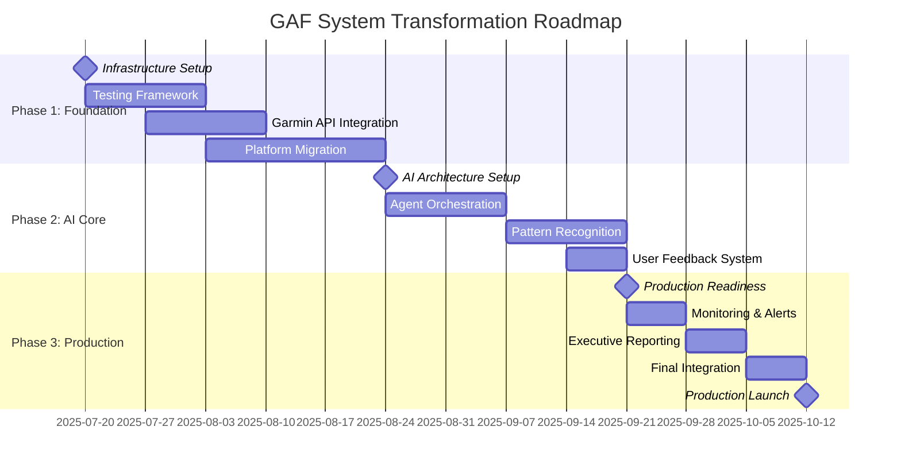
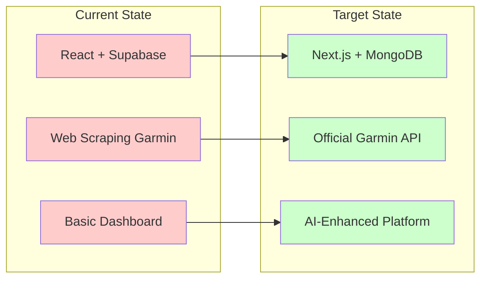

# GAF System - Project Roadmap & Timeline

## Executive Overview

**Project:** GAF Analysis Dashboard AI Enhancement & Production Readiness  
**Duration:** 12 weeks (July 2025 - September 2025)  
**Status:** Planning Phase  
**Budget:** Layer-optimized architecture with $0-300/month scaling  

## Major Milestones & Timeline

## Critical Path Analysis

### 🔴 Critical Dependencies
1. **Garmin API Integration** → All health data processing
2. **MongoDB Migration** → Multi-user architecture
3. **AI Agent Orchestration** → Core value proposition
4. **Testing Framework** → Quality assurance foundation

### ⚠️ Risk Mitigation Timeline
- **Week 1-2:** Comprehensive testing infrastructure (prevents circular debugging)
- **Week 3-4:** Reliable Garmin integration (foundation for all analysis)
- **Week 5-7:** Platform migration with rollback capabilities
- **Week 8-12:** AI enhancement with fallback mechanisms

## Resource Allocation

| Phase | Development Focus | Risk Level | Success Criteria |
|-------|------------------|------------|------------------|
| **Foundation** | Infrastructure & Reliability | 🔴 High | Stable data flow, comprehensive testing |
| **AI Core** | Intelligence & Automation | 🟡 Medium | Working agent orchestration, pattern recognition |
| **Production** | Scalability & Monitoring | 🟢 Low | Performance targets, professional reporting |

## Technology Migration Path

## Success Metrics

### Technical KPIs
- **Response Time:** <2 seconds for AI analysis
- **Uptime:** 99.9% availability
- **Data Accuracy:** 100% Garmin sync reliability
- **Test Coverage:** >90% automated test coverage

### Business KPIs
- **User Experience:** Seamless migration with zero data loss
- **AI Quality:** User feedback validation >85% accuracy
- **Cost Efficiency:** Stay within $0-300/month scaling plan
- **Framework Evolution:** Modular architecture supporting future enhancements

## Next Actions

1. **Immediate (Week 1):** Setup comprehensive testing framework
2. **Priority (Week 2):** Begin Garmin API integration
3. **Strategic (Week 3):** Start MongoDB migration planning
4. **Continuous:** Risk monitoring and mitigation adjustments