# GAF System - Architecture Diagram

## System Architecture Overview

The GAF System follows a **layer-optimized 5-platform architecture** designed for scalability, user isolation, and AI-first health intelligence.

## High-Level Architecture

```mermaid
graph TB
    subgraph "User Layer"
        USER[👤 User]
        MOBILE[📱 Mobile App]
        WEB[💻 Web Dashboard]
    end
    
    subgraph "Frontend Layer - Vercel + bit.dev"
        VERCEL[🚀 Vercel Hosting]
        BITDEV[🧩 bit.dev Components]
        NEXTJS[⚛️ Next.js App]
        COMPONENTS[🎨 Shared Components]
    end
    
    subgraph "Authentication Layer - Clerk"
        CLERK[🔐 Clerk Auth]
        SESSIONS[📝 Session Management]
        ORGS[🏢 Organizations]
    end
    
    subgraph "Backend Layer - Vercel Edge Functions"
        EDGE[⚡ Edge Functions]
        API[🔌 API Routes]
        MIDDLEWARE[🛡️ Auth Middleware]
    end
    
    subgraph "AI Layer - Multi-Provider"
        GEMINI[🤖 Gemini SDK - Primary]
        CLAUDE[🧠 Claude API - Quality]
        ROUTER[🎯 LLM Router]
        AGENTS[👥 AI Agent Teams]
    end
    
    subgraph "Data Layer - MongoDB Atlas"
        MONGO[🍃 MongoDB Atlas]
        VECTOR[🔍 Vector Search]
        COLLECTIONS[📊 Health Collections]
        ISOLATION[🔒 User Isolation]
    end
    
    subgraph "External Integrations"
        GARMIN[⌚ Garmin Health API]
        OAUTH[🔑 OAuth 1.0a]
    end
    
    USER --> MOBILE
    USER --> WEB
    MOBILE --> VERCEL
    WEB --> VERCEL
    
    VERCEL --> NEXTJS
    VERCEL --> BITDEV
    NEXTJS --> COMPONENTS
    
    VERCEL --> CLERK
    CLERK --> SESSIONS
    CLERK --> ORGS
    
    VERCEL --> EDGE
    EDGE --> API
    EDGE --> MIDDLEWARE
    
    API --> ROUTER
    ROUTER --> GEMINI
    ROUTER --> CLAUDE
    ROUTER --> AGENTS
    
    API --> MONGO
    MONGO --> VECTOR
    MONGO --> COLLECTIONS
    MONGO --> ISOLATION
    
    API --> GARMIN
    GARMIN --> OAUTH
    
    style VERCEL fill:#000000,color:#ffffff
    style CLERK fill:#6C47FF,color:#ffffff
    style GEMINI fill:#4285F4,color:#ffffff
    style CLAUDE fill:#FF6B35,color:#ffffff
    style MONGO fill:#47A248,color:#ffffff
    style GARMIN fill:#007CC3,color:#ffffff
```

## Detailed Component Architecture

### Frontend Architecture (Vercel + bit.dev)

```mermaid
graph TB
    subgraph "Frontend Components"
        APP[📱 Next.js App]
        PAGES[📄 Pages]
        COMPONENTS[🧩 Components]
        HOOKS[🎣 Custom Hooks]
        UTILS[🛠️ Utilities]
    end
    
    subgraph "bit.dev Component Library"
        HEALTH[💊 Health Components]
        CHARTS[📊 Chart Components]
        AI[🤖 AI Interface Components]
        FORMS[📝 Form Components]
    end
    
    subgraph "State Management"
        TANSTACK[🔄 TanStack Query]
        ZUSTAND[🐻 Zustand Store]
        CONTEXT[🌐 React Context]
    end
    
    APP --> PAGES
    PAGES --> COMPONENTS
    COMPONENTS --> HOOKS
    COMPONENTS --> UTILS
    
    COMPONENTS --> HEALTH
    COMPONENTS --> CHARTS
    COMPONENTS --> AI
    COMPONENTS --> FORMS
    
    HOOKS --> TANSTACK
    HOOKS --> ZUSTAND
    HOOKS --> CONTEXT
    
    style APP fill:#000000,color:#ffffff
    style HEALTH fill:#FF6B6B,color:#ffffff
    style CHARTS fill:#4ECDC4,color:#ffffff
    style AI fill:#45B7D1,color:#ffffff
```

### AI Agent Orchestration

```mermaid
graph TB
    subgraph "Master Orchestrator"
        MASTER[🎭 Master Agent]
        ROUTER[🎯 LLM Router]
        QUEUE[📋 Task Queue]
    end
    
    subgraph "Specialized Agents"
        PATTERN[🔍 Pattern Recognition Agent]
        RECOMMEND[💡 Recommendation Agent]
        ALERT[🚨 Alert Detection Agent]
        REPORT[📊 Executive Report Agent]
    end
    
    subgraph "User Isolation"
        USER1[👤 User 1 Agents]
        USER2[👤 User 2 Agents]
        USERN[👤 User N Agents]
    end
    
    subgraph "Knowledge Base"
        PATTERNS[🧠 Pattern Library]
        FEEDBACK[💬 User Feedback]
        LEARNING[📚 Continuous Learning]
    end
    
    MASTER --> ROUTER
    MASTER --> QUEUE
    
    ROUTER --> PATTERN
    ROUTER --> RECOMMEND
    ROUTER --> ALERT
    ROUTER --> REPORT
    
    PATTERN --> USER1
    RECOMMEND --> USER2
    ALERT --> USERN
    
    USER1 --> PATTERNS
    USER2 --> FEEDBACK
    USERN --> LEARNING
    
    style MASTER fill:#FF6B35,color:#ffffff
    style PATTERN fill:#4285F4,color:#ffffff
    style USER1 fill:#34A853,color:#ffffff
    style PATTERNS fill:#9C27B0,color:#ffffff
```

### Data Architecture (MongoDB Atlas)

```mermaid
graph TB
    subgraph "User Collections"
        USERS[👥 Users Collection]
        PROFILES[📋 User Profiles]
        SETTINGS[⚙️ User Settings]
    end
    
    subgraph "Health Data Collections"
        DAILY[📅 Daily Entries]
        GARMIN[⌚ Garmin Data]
        PATTERNS[🔍 Health Patterns]
        ANALYSIS[📊 Analysis Results]
    end
    
    subgraph "GAF Framework Collections"
        FRAMEWORK[🏗️ Framework Definitions]
        METRICS[📏 Metric Calculations]
        THRESHOLDS[🎯 User Thresholds]
        VERSIONS[📝 Framework Versions]
    end
    
    subgraph "AI Collections"
        AGENTS[🤖 Agent Configurations]
        FEEDBACK[💬 User Feedback]
        LEARNING[🧠 Learning Data]
        EMBEDDINGS[🔢 Vector Embeddings]
    end
    
    subgraph "Vector Search Indexes"
        HEALTH_VECTORS[🔍 Health Pattern Vectors]
        SIMILARITY[📊 Similarity Search]
        SEMANTIC[🧠 Semantic Matching]
    end
    
    USERS --> PROFILES
    USERS --> SETTINGS
    
    DAILY --> GARMIN
    DAILY --> PATTERNS
    PATTERNS --> ANALYSIS
    
    FRAMEWORK --> METRICS
    FRAMEWORK --> THRESHOLDS
    FRAMEWORK --> VERSIONS
    
    AGENTS --> FEEDBACK
    FEEDBACK --> LEARNING
    LEARNING --> EMBEDDINGS
    
    EMBEDDINGS --> HEALTH_VECTORS
    HEALTH_VECTORS --> SIMILARITY
    SIMILARITY --> SEMANTIC
    
    style USERS fill:#47A248,color:#ffffff
    style DAILY fill:#FF6B6B,color:#ffffff
    style FRAMEWORK fill:#4ECDC4,color:#ffffff
    style AGENTS fill:#45B7D1,color:#ffffff
    style HEALTH_VECTORS fill:#9C27B0,color:#ffffff
```

## Security Architecture

```mermaid
graph TB
    subgraph "Authentication Flow"
        LOGIN[🔐 User Login]
        CLERK_AUTH[🎫 Clerk Authentication]
        JWT[🎟️ JWT Token]
        SESSION[📝 Session Management]
    end
    
    subgraph "Authorization Layers"
        MIDDLEWARE[🛡️ Auth Middleware]
        RBAC[👮 Role-Based Access]
        USER_ISOLATION[🔒 User Data Isolation]
    end
    
    subgraph "Data Security"
        ENCRYPTION[🔐 Data Encryption]
        SECRETS[🗝️ Secret Management]
        AUDIT[📋 Audit Logging]
    end
    
    subgraph "API Security"
        RATE_LIMIT[⏱️ Rate Limiting]
        CORS[🌐 CORS Policy]
        VALIDATION[✅ Input Validation]
    end
    
    LOGIN --> CLERK_AUTH
    CLERK_AUTH --> JWT
    JWT --> SESSION
    
    SESSION --> MIDDLEWARE
    MIDDLEWARE --> RBAC
    RBAC --> USER_ISOLATION
    
    USER_ISOLATION --> ENCRYPTION
    ENCRYPTION --> SECRETS
    SECRETS --> AUDIT
    
    MIDDLEWARE --> RATE_LIMIT
    RATE_LIMIT --> CORS
    CORS --> VALIDATION
    
    style CLERK_AUTH fill:#6C47FF,color:#ffffff
    style ENCRYPTION fill:#FF6B35,color:#ffffff
    style USER_ISOLATION fill:#34A853,color:#ffffff
```

## Deployment Architecture

```mermaid
graph TB
    subgraph "Development Environment"
        DEV_VERCEL[🚀 Vercel Preview]
        DEV_MONGO[🍃 MongoDB Dev]
        DEV_CLERK[🔐 Clerk Dev]
    end
    
    subgraph "Staging Environment"
        STAGE_VERCEL[🚀 Vercel Staging]
        STAGE_MONGO[🍃 MongoDB Staging]
        STAGE_CLERK[🔐 Clerk Staging]
    end
    
    subgraph "Production Environment"
        PROD_VERCEL[🚀 Vercel Production]
        PROD_MONGO[🍃 MongoDB Production]
        PROD_CLERK[🔐 Clerk Production]
    end
    
    subgraph "CI/CD Pipeline"
        GITHUB[📦 GitHub Repository]
        ACTIONS[⚙️ GitHub Actions]
        TESTS[🧪 Automated Tests]
        DEPLOY[🚀 Deployment]
    end
    
    GITHUB --> ACTIONS
    ACTIONS --> TESTS
    TESTS --> DEV_VERCEL
    
    DEV_VERCEL --> STAGE_VERCEL
    STAGE_VERCEL --> PROD_VERCEL
    
    DEV_MONGO --> STAGE_MONGO
    STAGE_MONGO --> PROD_MONGO
    
    DEV_CLERK --> STAGE_CLERK
    STAGE_CLERK --> PROD_CLERK
    
    style GITHUB fill:#000000,color:#ffffff
    style PROD_VERCEL fill:#000000,color:#ffffff
    style PROD_MONGO fill:#47A248,color:#ffffff
    style PROD_CLERK fill:#6C47FF,color:#ffffff
```

## Performance & Scalability

### Response Time Architecture

```mermaid
graph LR
    subgraph "Performance Targets"
        USER_REQ[👤 User Request]
        EDGE_CACHE[⚡ Edge Cache <100ms]
        API_RESPONSE[🔌 API Response <500ms]
        AI_ANALYSIS[🤖 AI Analysis <2s]
        DB_QUERY[🍃 DB Query <200ms]
    end
    
    USER_REQ --> EDGE_CACHE
    EDGE_CACHE --> API_RESPONSE
    API_RESPONSE --> DB_QUERY
    API_RESPONSE --> AI_ANALYSIS
    
    style USER_REQ fill:#FF6B6B,color:#ffffff
    style EDGE_CACHE fill:#4ECDC4,color:#ffffff
    style AI_ANALYSIS fill:#45B7D1,color:#ffffff
```

### Scaling Strategy

| Component | Current Capacity | Scale Trigger | Scaling Method |
|-----------|------------------|---------------|----------------|
| **Vercel Edge** | Global CDN | Automatic | Edge scaling |
| **MongoDB Atlas** | M0 Free Tier | 500 connections | Vertical scaling |
| **Clerk Auth** | 10K MAU free | 10K users | Automatic scaling |
| **AI APIs** | Rate limited | Usage patterns | Multi-provider routing |

## Technology Stack Summary

| Layer | Technology | Purpose | Cost (Monthly) |
|-------|------------|---------|----------------|
| **Frontend** | Vercel + bit.dev | Hosting + Components | $0-20 |
| **Auth** | Clerk | Authentication | $0-25 |
| **Backend** | Vercel Edge Functions | API + Logic | $0-20 |
| **AI** | Gemini + Claude | Intelligence | $0-100 |
| **Database** | MongoDB Atlas | Data + Vector Search | $0-9 |
| **Total** | **5 Platforms** | **Complete Stack** | **$0-174** |