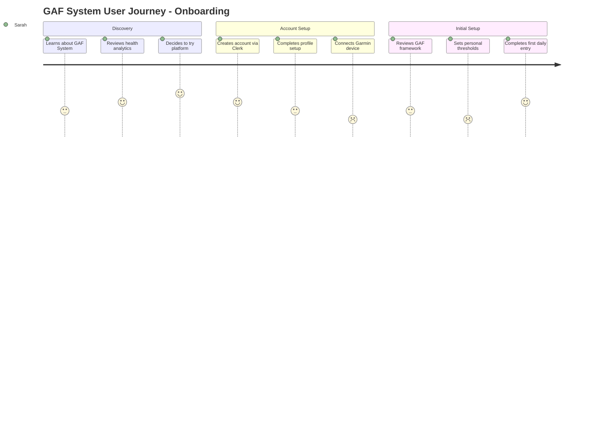
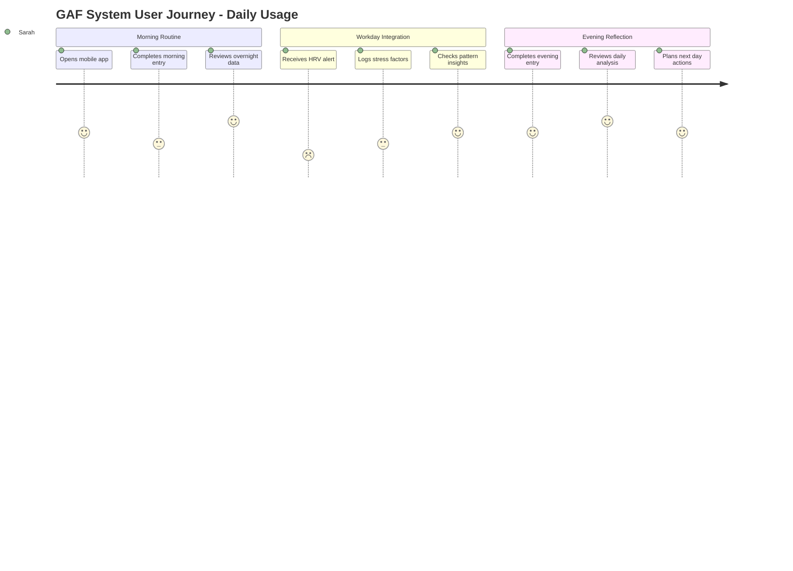
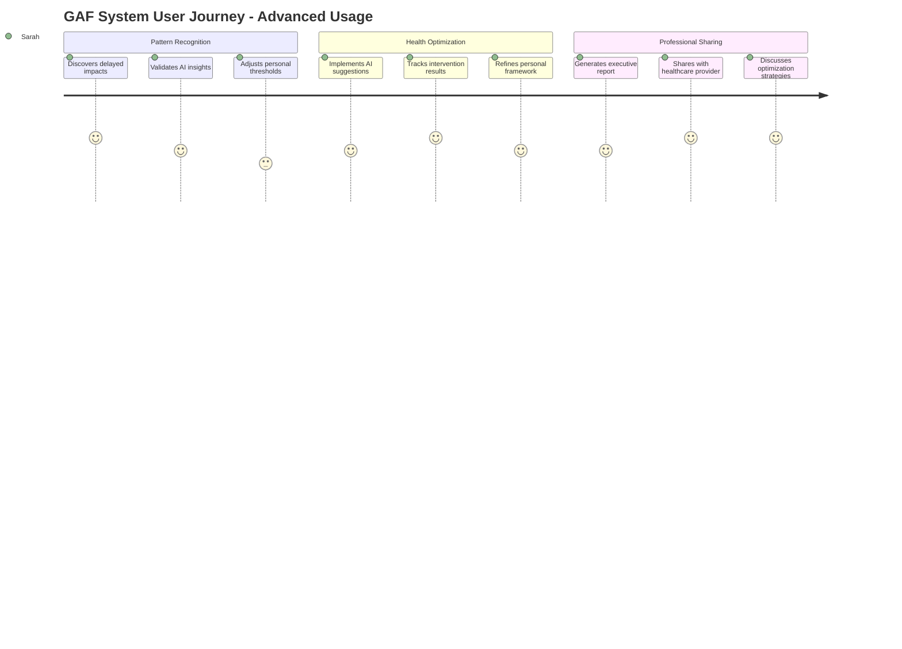
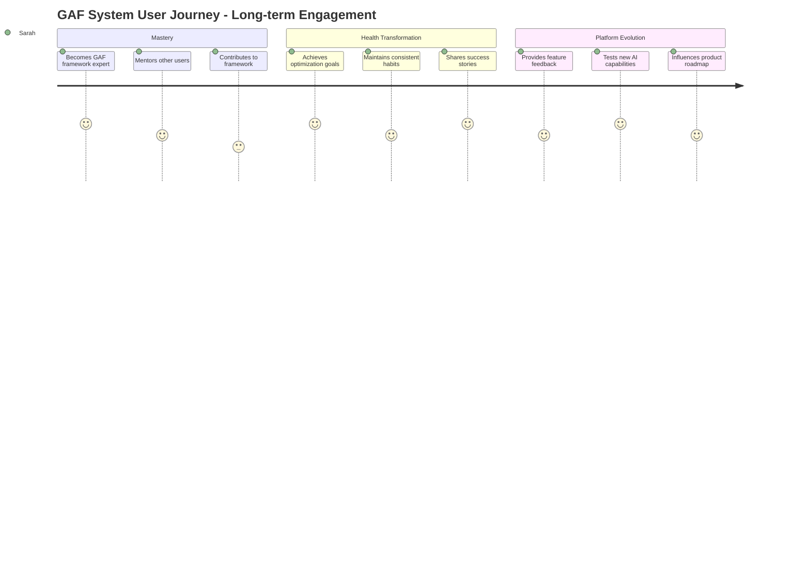
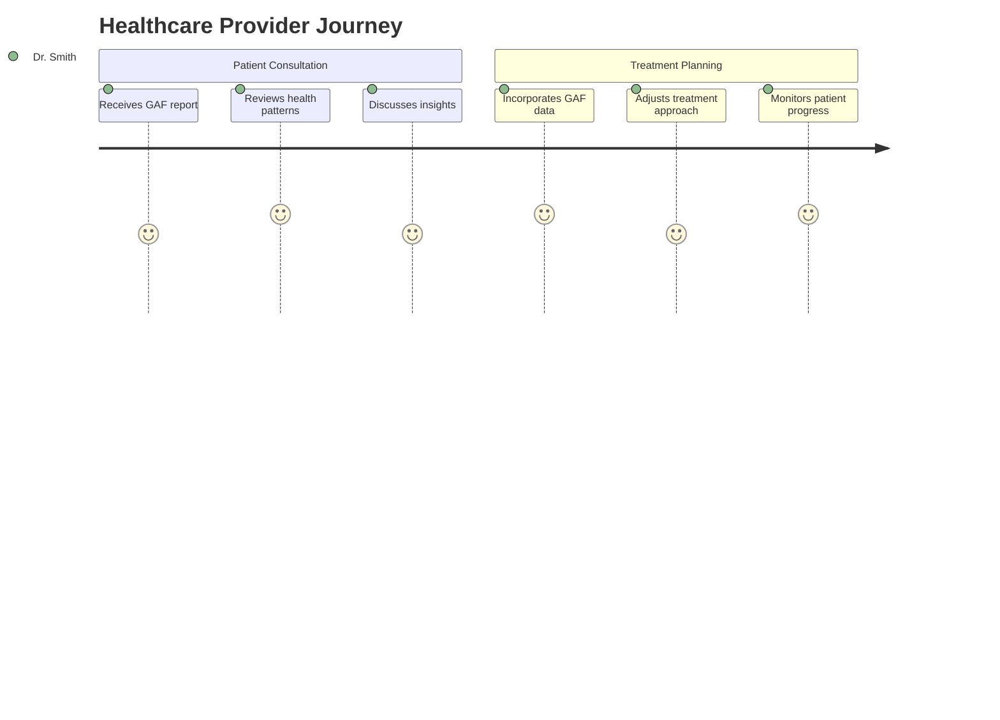
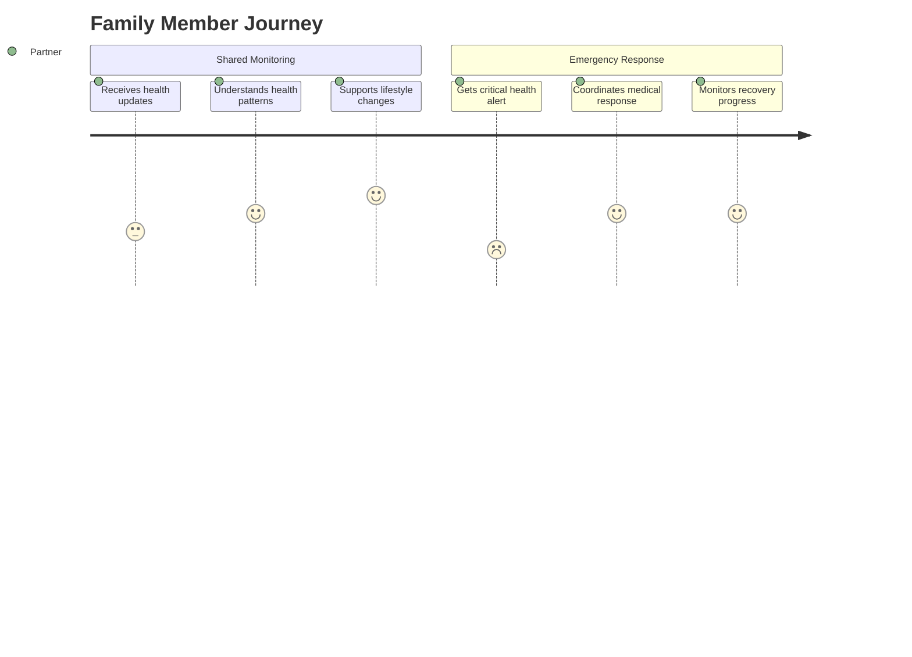

# GAF System - User Journey Map

## User Personas & Journey Overview

The GAF System serves multiple user types with distinct needs and interaction patterns. This journey map focuses on the primary persona while acknowledging secondary users.

## Primary Persona: Health-Conscious Individual

**Profile:** Sarah, 35, Software Engineer  
**Goals:** Optimize health through data-driven insights, understand delayed impacts of lifestyle choices  
**Pain Points:** Fragmented health data, lack of personalized insights, difficulty identifying patterns  
**Tech Comfort:** High - comfortable with complex interfaces and data analysis  

## Complete User Journey Map

### Phase 1: Discovery & Onboarding

#### Detailed Onboarding Flow

| Step | User Action | System Response | Emotion | Pain Points | Opportunities |
|------|-------------|-----------------|---------|-------------|---------------|
| **1. Landing Page** | Visits GAF dashboard | Clean, health-focused design | 😐 Neutral | Unclear value proposition | Clear GAF framework explanation |
| **2. Sign Up** | Creates account | Clerk auth flow | 😊 Positive | Standard process | Streamlined mobile-first UX |
| **3. Profile Setup** | Enters basic info | Guided form with progress | 😐 Neutral | Form fatigue | Smart defaults, optional fields |
| **4. Garmin Connection** | Authorizes Garmin | OAuth 1.0a flow | 😟 Concerned | Complex authorization | Clear privacy explanation |
| **5. Framework Intro** | Learns GAF system | Interactive tutorial | 🤔 Curious | Information overload | Progressive disclosure |
| **6. First Entry** | Completes daily form | Immediate feedback | 😊 Positive | Long form (794 lines) | Smart form sections |

### Phase 2: Daily Usage & Habit Formation

#### Daily Interaction Patterns

**Morning (7:00-9:00 AM)**
- **Touchpoint:** Mobile app notification
- **Action:** Quick health metrics entry (2-3 minutes)
- **Value:** Overnight recovery insights, day planning
- **Emotion:** 😊 Motivated by insights
- **Friction:** Form complexity on mobile

**Midday (12:00-2:00 PM)**
- **Touchpoint:** Web dashboard during lunch
- **Action:** Review patterns, log additional factors
- **Value:** Real-time health monitoring, stress management
- **Emotion:** 🤔 Analytical, data-driven decisions
- **Friction:** Context switching between work and health

**Evening (8:00-10:00 PM)**
- **Touchpoint:** Comprehensive web interface
- **Action:** Detailed daily reflection, pattern analysis
- **Value:** Deep insights, trend identification
- **Emotion:** 😌 Satisfied with daily completion
- **Friction:** Fatigue affecting data quality

### Phase 3: Advanced Usage & Optimization

#### Advanced Feature Adoption

| Feature | Adoption Timeline | User Benefit | Engagement Level | Success Metrics |
|---------|------------------|--------------|------------------|-----------------|
| **AI Pattern Recognition** | Week 2-3 | Automated insights discovery | 🔥 High | 85% weekly usage |
| **Custom Thresholds** | Week 4-6 | Personalized alerts | 🔥 High | 70% threshold customization |
| **Executive Reports** | Month 2-3 | Professional health communication | 🔥 Medium | 40% monthly generation |
| **Framework Customization** | Month 3-6 | Tailored analysis approach | 🔥 Medium | 25% framework modification |

### Phase 4: Long-term Engagement & Mastery

## Secondary User Journeys

### Healthcare Provider Journey

### Family Member Journey

## Critical User Experience Moments

### 🎯 Moment of Truth #1: First AI Insight
**When:** Day 3-7 of usage  
**What:** User receives first personalized pattern recognition  
**Impact:** Determines long-term engagement  
**Success Factors:**
- Insight must be actionable and relevant
- Clear explanation of how pattern was identified
- Confidence scoring to build trust

### 🎯 Moment of Truth #2: Garmin Data Sync
**When:** Initial setup and ongoing  
**What:** Seamless health data integration  
**Impact:** Foundation for all analysis  
**Success Factors:**
- Reliable OAuth flow without errors
- Complete historical data import
- Real-time sync with visual confirmation

### 🎯 Moment of Truth #3: Mobile Daily Entry
**When:** Daily, morning routine  
**What:** Quick, efficient data entry on mobile  
**Impact:** Habit formation and retention  
**Success Factors:**
- <2 minute completion time
- Smart defaults and predictions
- Offline capability with sync

## Pain Points & Solutions

### Current Pain Points (Existing System)

| Pain Point | User Impact | Frequency | Severity | Proposed Solution |
|------------|-------------|-----------|----------|-------------------|
| **Garmin Sync Failures** | Data gaps, unreliable analysis | Daily | 🔴 Critical | Official Garmin API with retry logic |
| **Complex Daily Form** | Form fatigue, abandonment | Daily | 🟡 Medium | Progressive disclosure, smart sections |
| **Circular Debugging** | Development delays | Development | 🔴 Critical | Comprehensive testing framework |
| **No Mobile Optimization** | Poor mobile experience | Daily | 🟡 Medium | Mobile-first responsive design |
| **Limited AI Insights** | Manual pattern recognition | Weekly | 🟡 Medium | AI agent orchestration |

### Emotional Journey Mapping

```mermaid
graph TB
    subgraph "Emotional Peaks & Valleys"
        DISCOVERY[😊 Discovery Excitement]
        SETUP[😟 Setup Anxiety]
        FIRST_INSIGHT[🤩 First AI Insight]
        DAILY_HABIT[😐 Routine Neutrality]
        PATTERN_DISCOVERY[🤯 Pattern Breakthrough]
        OPTIMIZATION[😌 Health Optimization]
        MASTERY[😎 Framework Mastery]
    end
    
    DISCOVERY --> SETUP
    SETUP --> FIRST_INSIGHT
    FIRST_INSIGHT --> DAILY_HABIT
    DAILY_HABIT --> PATTERN_DISCOVERY
    PATTERN_DISCOVERY --> OPTIMIZATION
    OPTIMIZATION --> MASTERY
    
    style DISCOVERY fill:#4ECDC4,color:#ffffff
    style SETUP fill:#FF6B6B,color:#ffffff
    style FIRST_INSIGHT fill:#45B7D1,color:#ffffff
    style PATTERN_DISCOVERY fill:#96CEB4,color:#ffffff
    style MASTERY fill:#FFEAA7,color:#000000
```

## User Journey Optimization Strategies

### Onboarding Optimization
1. **Progressive Onboarding:** Spread setup across multiple sessions
2. **Value-First Approach:** Show sample insights before data entry
3. **Social Proof:** Success stories and testimonials
4. **Gamification:** Progress tracking and achievement badges

### Daily Engagement Optimization
1. **Smart Notifications:** Personalized timing based on user patterns
2. **Micro-Interactions:** Quick wins and positive reinforcement
3. **Context Awareness:** Location and time-based form adaptations
4. **Habit Stacking:** Integration with existing routines

### Long-term Retention Optimization
1. **Continuous Learning:** New insights and pattern discoveries
2. **Community Features:** User forums and shared experiences
3. **Professional Integration:** Healthcare provider collaboration
4. **Framework Evolution:** User-driven feature development

## Success Metrics by Journey Phase

### Onboarding Success (Week 1)
- **Completion Rate:** >80% complete onboarding flow
- **Garmin Connection:** >90% successful OAuth completion
- **First Entry:** >70% complete first daily entry
- **Time to Value:** <48 hours to first AI insight

### Engagement Success (Month 1)
- **Daily Active Users:** >60% daily engagement
- **Form Completion:** >85% daily entry completion rate
- **Feature Adoption:** >50% use advanced features
- **User Satisfaction:** >4.5/5 user rating

### Retention Success (Month 3+)
- **Monthly Retention:** >80% month-over-month retention
- **Feature Mastery:** >30% customize framework settings
- **Advocacy:** >40% recommend to others
- **Health Outcomes:** Measurable improvement in user-defined metrics

## Journey-Driven Development Priorities

Based on this user journey analysis, development should prioritize:

1. **Critical Path:** Reliable Garmin integration (foundation for all value)
2. **Quick Wins:** Mobile-optimized daily entry (daily touchpoint)
3. **Differentiation:** AI pattern recognition (unique value proposition)
4. **Retention:** Professional reporting (long-term engagement)
5. **Scale:** Multi-user architecture (growth enablement)