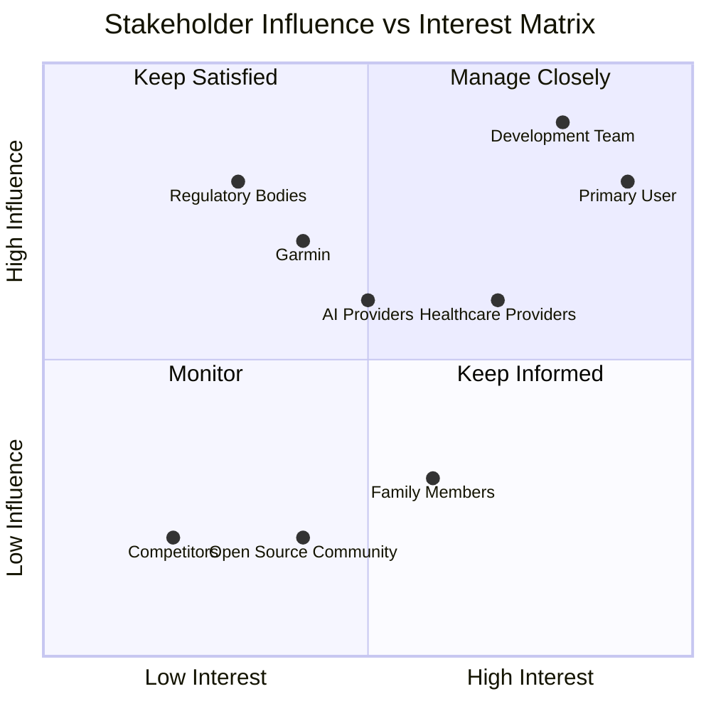

# GAF System - Stakeholder Map

## Stakeholder Ecosystem Overview

The GAF System operates within a complex ecosystem of stakeholders, each with distinct interests, influence levels, and impact on project success. This map identifies key relationships and engagement strategies.

## Stakeholder Influence-Interest Matrix

## Primary Stakeholders (Manage Closely)

### 1. Primary User (Health-Conscious Individual)
**Profile:** Sarah, 35, Software Engineer seeking health optimization  
**Interest Level:** 🔥 Very High - Personal health and data insights  
**Influence Level:** 🔥 Very High - Product direction and success metrics  

**Needs & Expectations:**
- Reliable, accurate health data integration
- Actionable, personalized insights
- Privacy and data security
- Mobile-first user experience
- Professional-grade reporting capabilities

**Engagement Strategy:**
- Weekly user feedback sessions
- Beta testing for new features
- Direct communication channel for issues
- User advisory board participation

**Success Metrics:**
- Daily active usage >80%
- User satisfaction score >4.5/5
- Feature adoption rate >70%
- Retention rate >90% monthly

### 2. Development Team
**Profile:** Full-stack developers, AI specialists, UX designers  
**Interest Level:** 🔥 Very High - Technical excellence and career growth  
**Influence Level:** 🔥 Very High - Implementation quality and timeline  

**Needs & Expectations:**
- Clear technical requirements and architecture
- Adequate development resources and tools
- Reasonable timelines and scope management
- Professional development opportunities
- Quality assurance and testing infrastructure

**Engagement Strategy:**
- Daily standups and sprint planning
- Technical architecture reviews
- Code quality standards and peer reviews
- Professional development budget allocation

**Success Metrics:**
- Sprint velocity consistency
- Code quality metrics >90%
- Bug resolution time <24 hours
- Team satisfaction score >4.0/5

## Secondary Stakeholders (Keep Satisfied)

### 3. Healthcare Providers
**Profile:** Physicians, specialists, health coaches  
**Interest Level:** 🔥 High - Patient care enhancement and data insights  
**Influence Level:** 🔥 Medium-High - Professional validation and adoption  

**Needs & Expectations:**
- HIPAA-compliant data sharing
- Professional-grade reports and visualizations
- Integration with existing healthcare workflows
- Evidence-based insights and recommendations
- Clear data provenance and reliability indicators

**Engagement Strategy:**
- Healthcare provider advisory panel
- Medical conference presentations
- Pilot programs with select practices
- Professional certification and training

**Success Metrics:**
- Healthcare provider adoption rate
- Report sharing frequency
- Clinical outcome improvements
- Professional endorsements

### 4. Garmin (External Integration Partner)
**Profile:** Wearable technology company and data provider  
**Interest Level:** 🔥 Medium - API usage and partnership opportunities  
**Influence Level:** 🔥 High - Data access and integration reliability  

**Needs & Expectations:**
- Proper API usage within rate limits
- Compliance with terms of service
- User privacy protection
- Potential partnership opportunities
- Positive brand association

**Engagement Strategy:**
- Official developer program participation
- Regular API usage monitoring
- Partnership exploration discussions
- Joint marketing opportunities

**Success Metrics:**
- API compliance rate 100%
- Data sync reliability >99.5%
- User authorization success rate >95%
- Partnership development progress

## Tertiary Stakeholders (Keep Informed)

### 5. AI/ML Service Providers
**Profile:** Gemini SDK, Claude API, Vertex AI teams  
**Interest Level:** 🔥 Medium - API usage and showcase opportunities  
**Influence Level:** 🔥 Medium - Service availability and capabilities  

**Needs & Expectations:**
- Responsible AI usage and ethical implementation
- Showcase opportunities for successful implementations
- Feedback on API capabilities and limitations
- Compliance with usage policies

**Engagement Strategy:**
- Regular usage reporting and feedback
- Case study development and sharing
- Beta testing for new AI capabilities
- Technical advisory participation

### 6. Family Members & Support Network
**Profile:** Spouses, family members, close friends  
**Interest Level:** 🔥 Medium-High - Loved one's health and wellbeing  
**Influence Level:** 🔥 Low-Medium - User motivation and adoption  

**Needs & Expectations:**
- Transparency in health monitoring
- Emergency alert capabilities
- Privacy controls and consent management
- Easy-to-understand health summaries

**Engagement Strategy:**
- Family sharing feature development
- Emergency contact integration
- Privacy education and controls
- Support network engagement features

## Regulatory & Compliance Stakeholders (Monitor)

### 7. Regulatory Bodies
**Profile:** FDA, HIPAA, GDPR, state health departments  
**Interest Level:** 🔥 Low-Medium - Compliance and consumer protection  
**Influence Level:** 🔥 High - Legal requirements and operational constraints  

**Needs & Expectations:**
- Full compliance with health data regulations
- Transparent privacy policies and practices
- Appropriate medical disclaimers
- Data security and breach prevention

**Engagement Strategy:**
- Legal compliance review and certification
- Regular privacy policy updates
- Security audit and penetration testing
- Regulatory change monitoring

### 8. Open Source Community
**Profile:** Developers, health tech enthusiasts, researchers  
**Interest Level:** 🔥 Medium - Innovation and knowledge sharing  
**Influence Level:** 🔥 Low - Community support and contributions  

**Needs & Expectations:**
- Open source components and contributions
- Technical documentation and best practices
- Community engagement and support
- Innovation sharing and collaboration

**Engagement Strategy:**
- Open source component contributions
- Technical blog posts and documentation
- Conference presentations and workshops
- Community forum participation

## Competitive Landscape (Monitor)

### 9. Direct Competitors
**Profile:** MyFitnessPal, Cronometer, health analytics platforms  
**Interest Level:** 🔥 Low - Market intelligence and differentiation  
**Influence Level:** 🔥 Low-Medium - Market positioning and features  

**Monitoring Strategy:**
- Feature comparison and analysis
- Pricing and positioning tracking
- User migration patterns
- Technology trend analysis

### 10. Indirect Competitors
**Profile:** Apple Health, Google Fit, Fitbit ecosystem  
**Interest Level:** 🔥 Low - Ecosystem integration opportunities  
**Influence Level:** 🔥 Medium - Platform dependencies and integration  

**Monitoring Strategy:**
- Platform API changes and updates
- Integration opportunity assessment
- User ecosystem preferences
- Partnership potential evaluation

## Stakeholder Communication Plan

### High-Frequency Communication (Weekly)

| Stakeholder | Communication Method | Frequency | Content Focus |
|-------------|---------------------|-----------|---------------|
| **Primary User** | Direct feedback, surveys | Weekly | Feature feedback, usage patterns |
| **Development Team** | Standups, sprint reviews | Daily/Weekly | Progress, blockers, technical decisions |
| **Healthcare Providers** | Advisory calls, reports | Bi-weekly | Clinical insights, feature requests |

### Medium-Frequency Communication (Monthly)

| Stakeholder | Communication Method | Frequency | Content Focus |
|-------------|---------------------|-----------|---------------|
| **Garmin** | API usage reports | Monthly | Compliance, partnership opportunities |
| **AI Providers** | Usage analytics, feedback | Monthly | Performance, feature requests |
| **Family Members** | Product updates, features | Monthly | New capabilities, privacy updates |

### Low-Frequency Communication (Quarterly)

| Stakeholder | Communication Method | Frequency | Content Focus |
|-------------|---------------------|-----------|---------------|
| **Regulatory Bodies** | Compliance reports | Quarterly | Legal compliance, security updates |
| **Open Source Community** | Blog posts, conferences | Quarterly | Technical insights, contributions |
| **Competitors** | Market analysis | Quarterly | Competitive positioning, trends |

## Stakeholder Risk Assessment

### High-Risk Stakeholders

| Stakeholder | Risk Type | Impact | Mitigation Strategy |
|-------------|-----------|--------|-------------------|
| **Primary User** | Churn/Dissatisfaction | 🔴 Critical | Continuous feedback, rapid issue resolution |
| **Garmin** | API Access Revocation | 🔴 Critical | Compliance monitoring, backup data sources |
| **Regulatory Bodies** | Compliance Violations | 🔴 Critical | Legal review, security audits |

### Medium-Risk Stakeholders

| Stakeholder | Risk Type | Impact | Mitigation Strategy |
|-------------|-----------|--------|-------------------|
| **Healthcare Providers** | Professional Rejection | 🟡 Medium | Clinical validation, professional engagement |
| **Development Team** | Resource Constraints | 🟡 Medium | Scope management, team satisfaction |
| **AI Providers** | Service Limitations | 🟡 Medium | Multi-provider strategy, fallback options |

## Stakeholder Success Metrics

### Primary Success Indicators
- **User Satisfaction:** >4.5/5 rating across all user segments
- **Healthcare Adoption:** >20% of users share reports with providers
- **Technical Reliability:** >99.5% uptime and data accuracy
- **Regulatory Compliance:** 100% compliance with all applicable regulations

### Secondary Success Indicators
- **Community Engagement:** Active participation in health tech forums
- **Partnership Development:** Formal partnerships with 2+ healthcare organizations
- **Innovation Recognition:** Industry awards or recognition for AI health analytics
- **Market Position:** Top 3 in health analytics platform comparisons

## Stakeholder Engagement Evolution

### Phase 1: Foundation (Months 1-3)
**Focus:** Core stakeholders (User, Development Team, Garmin)  
**Goal:** Establish reliable foundation and basic functionality  
**Key Activities:** User feedback loops, technical implementation, API integration  

### Phase 2: Expansion (Months 4-6)
**Focus:** Healthcare providers, AI optimization  
**Goal:** Professional validation and advanced capabilities  
**Key Activities:** Clinical pilots, AI enhancement, professional reporting  

### Phase 3: Scale (Months 7-12)
**Focus:** Community, partnerships, market expansion  
**Goal:** Market leadership and ecosystem development  
**Key Activities:** Community building, strategic partnerships, competitive differentiation  

This stakeholder map provides a comprehensive framework for managing relationships and ensuring project success across all key constituencies. Regular review and updates ensure continued alignment with stakeholder needs and project evolution.