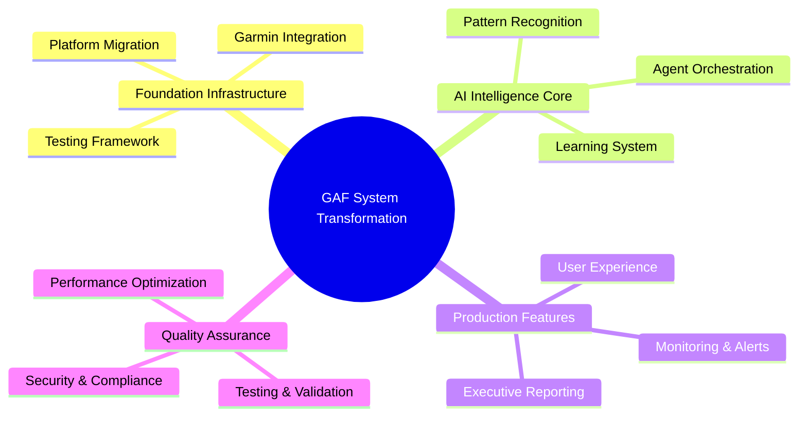
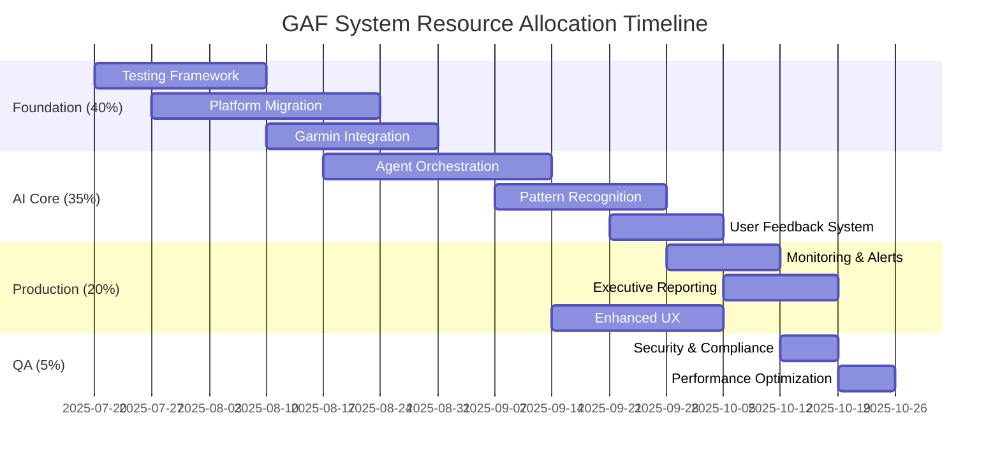

# GAF System - Work Breakdown Structure (WBS)

## Project Hierarchy Overview

The GAF System transformation follows a hierarchical work breakdown structure organized by major deliverables, with clear dependencies and resource allocation across all project phases.

## Level 1: Project Deliverables

## Level 2: Major Work Packages

### 1. Foundation Infrastructure (40% of total effort)

#### 1.1 Testing & Quality Framework
**Deliverable:** Comprehensive testing infrastructure preventing circular debugging  
**Duration:** 3 weeks  
**Resources:** 2 developers, 1 QA specialist  
**Dependencies:** None (critical path start)  

**Sub-deliverables:**
- Unit testing framework with Vitest
- Integration testing for AI agents
- End-to-end user workflow testing
- Automated regression testing
- QA agent implementation

#### 1.2 Platform Migration
**Deliverable:** Layer-optimized 5-platform architecture  
**Duration:** 4 weeks  
**Resources:** 3 developers, 1 DevOps engineer  
**Dependencies:** Testing framework completion  

**Sub-deliverables:**
- Vercel + Next.js frontend migration
- MongoDB Atlas database migration
- Clerk authentication integration
- bit.dev component library setup
- CI/CD pipeline establishment

#### 1.3 Garmin API Integration
**Deliverable:** Reliable official Garmin Health API integration  
**Duration:** 3 weeks  
**Resources:** 2 developers, 1 integration specialist  
**Dependencies:** Platform migration, OAuth setup  

**Sub-deliverables:**
- OAuth 1.0a authentication flow
- Comprehensive data validation
- Historical data import
- Real-time sync mechanisms
- Error handling and retry logic

### 2. AI Intelligence Core (35% of total effort)

#### 2.1 Multi-LLM Agent Orchestration
**Deliverable:** AI agent teams with intelligent LLM routing  
**Duration:** 4 weeks  
**Resources:** 2 AI specialists, 1 backend developer  
**Dependencies:** Foundation infrastructure, user data availability  

**Sub-deliverables:**
- Master orchestrator implementation
- Specialized agent development
- LLM router with provider selection
- User-isolated agent instances
- Knowledge persistence system

#### 2.2 Pattern Recognition & Learning
**Deliverable:** Personalized health pattern analysis system  
**Duration:** 3 weeks  
**Resources:** 1 ML engineer, 2 developers  
**Dependencies:** Agent orchestration, historical data  

**Sub-deliverables:**
- Multi-horizon timing logic (24-96h)
- Personalized threshold detection
- Cross-factor correlation analysis
- Vector search implementation
- Continuous learning integration

#### 2.3 User Feedback & Validation
**Deliverable:** AI learning system with user feedback integration  
**Duration:** 2 weeks  
**Resources:** 1 developer, 1 UX designer  
**Dependencies:** Pattern recognition system  

**Sub-deliverables:**
- Feedback collection interfaces
- AI insight validation workflows
- Learning pipeline integration
- Effectiveness tracking system
- User correction mechanisms

### 3. Production Features (20% of total effort)

#### 3.1 Real-time Monitoring & Alerts
**Deliverable:** Intelligent health monitoring with personalized alerts  
**Duration:** 2 weeks  
**Resources:** 2 developers  
**Dependencies:** AI core, user thresholds  

**Sub-deliverables:**
- Threshold-based alert system
- Multi-channel notifications
- Alert timing optimization
- Emergency protocol integration
- Alert effectiveness tracking

#### 3.2 Executive Reporting System
**Deliverable:** Professional health analysis reports  
**Duration:** 2 weeks  
**Resources:** 1 developer, 1 designer  
**Dependencies:** AI analysis, data visualization  

**Sub-deliverables:**
- Automated report generation
- Professional PDF export
- Customizable templates
- Secure sharing capabilities
- Historical trend analysis

#### 3.3 Enhanced User Experience
**Deliverable:** Mobile-optimized, AI-enhanced interface  
**Duration:** 3 weeks  
**Resources:** 2 frontend developers, 1 UX designer  
**Dependencies:** AI integration, component library  

**Sub-deliverables:**
- Mobile-first responsive design
- AI insight integration
- Progressive web app features
- Offline capability
- Performance optimization

### 4. Quality Assurance (5% of total effort)

#### 4.1 Security & Compliance
**Deliverable:** HIPAA-compliant, secure health data platform  
**Duration:** 1 week  
**Resources:** 1 security specialist, 1 compliance officer  
**Dependencies:** Platform migration, data architecture  

#### 4.2 Performance Optimization
**Deliverable:** <2 second response times, 99.9% uptime  
**Duration:** 1 week  
**Resources:** 1 performance engineer  
**Dependencies:** Complete system integration  

## Level 3: Detailed Task Breakdown

### 1.1.1 Unit Testing Framework Setup

| Task ID | Task Description | Duration | Resources | Dependencies |
|---------|------------------|----------|-----------|--------------|
| 1.1.1.1 | Configure Vitest with TypeScript | 2 days | 1 developer | None |
| 1.1.1.2 | Setup testing utilities and mocks | 3 days | 1 developer | Vitest config |
| 1.1.1.3 | Create test database configuration | 2 days | 1 developer | Platform setup |
| 1.1.1.4 | Implement test data factories | 3 days | 1 developer | Data models |
| 1.1.1.5 | Setup automated test execution | 2 days | 1 DevOps | CI/CD pipeline |

### 1.2.1 Platform Migration - Frontend

| Task ID | Task Description | Duration | Resources | Dependencies |
|---------|------------------|----------|-----------|--------------|
| 1.2.1.1 | React to Next.js migration | 5 days | 2 developers | Testing framework |
| 1.2.1.2 | Vercel deployment configuration | 2 days | 1 DevOps | Next.js setup |
| 1.2.1.3 | bit.dev component integration | 3 days | 1 developer | Component library |
| 1.2.1.4 | Environment configuration | 2 days | 1 DevOps | Platform setup |
| 1.2.1.5 | Performance optimization | 3 days | 1 developer | Deployment |

### 1.2.2 Platform Migration - Backend

| Task ID | Task Description | Duration | Resources | Dependencies |
|---------|------------------|----------|-----------|--------------|
| 1.2.2.1 | MongoDB Atlas cluster setup | 1 day | 1 DevOps | Account setup |
| 1.2.2.2 | Data model migration scripts | 4 days | 2 developers | Schema design |
| 1.2.2.3 | Clerk authentication integration | 3 days | 1 developer | Auth setup |
| 1.2.2.4 | API endpoint migration | 5 days | 2 developers | Database migration |
| 1.2.2.5 | User data migration validation | 2 days | 1 developer | Data migration |

### 1.3.1 Garmin API Integration

| Task ID | Task Description | Duration | Resources | Dependencies |
|---------|------------------|----------|-----------|--------------|
| 1.3.1.1 | Garmin developer account setup | 2 days | 1 developer | Application approval |
| 1.3.1.2 | OAuth 1.0a implementation | 4 days | 1 developer | API documentation |
| 1.3.1.3 | Data validation framework | 3 days | 1 developer | API endpoints |
| 1.3.1.4 | Historical data import | 4 days | 1 developer | OAuth flow |
| 1.3.1.5 | Real-time sync implementation | 2 days | 1 developer | Data validation |

### 2.1.1 AI Agent Orchestration

| Task ID | Task Description | Duration | Resources | Dependencies |
|---------|------------------|----------|-----------|--------------|
| 2.1.1.1 | Master orchestrator design | 3 days | 1 AI specialist | Architecture review |
| 2.1.1.2 | LLM router implementation | 4 days | 1 developer | Provider APIs |
| 2.1.1.3 | Specialized agent development | 6 days | 2 AI specialists | Orchestrator |
| 2.1.1.4 | User isolation implementation | 3 days | 1 developer | Multi-tenant design |
| 2.1.1.5 | Knowledge persistence system | 4 days | 1 developer | Database schema |

## Resource Allocation Matrix

### Team Composition & Allocation

| Role | Team Size | Allocation % | Key Responsibilities |
|------|-----------|--------------|---------------------|
| **Frontend Developers** | 2 | 25% | UI/UX, React/Next.js, mobile optimization |
| **Backend Developers** | 3 | 35% | API development, database, integrations |
| **AI Specialists** | 2 | 20% | Agent orchestration, ML models, pattern recognition |
| **DevOps Engineers** | 1 | 10% | Infrastructure, CI/CD, deployment |
| **QA Specialists** | 1 | 5% | Testing framework, quality assurance |
| **UX Designer** | 1 | 3% | User experience, interface design |
| **Security Specialist** | 0.5 | 2% | Security review, compliance |

### Timeline & Resource Distribution

## Risk-Based Work Prioritization

### Critical Path Items (Must Complete First)
1. **Testing Framework** - Foundation for all quality assurance
2. **Garmin API Integration** - Core data source for all analysis
3. **Platform Migration** - Infrastructure for scalability
4. **AI Agent Orchestration** - Core value proposition

### High-Risk Dependencies
- **Garmin Developer Approval** - External dependency, 3-5 day approval time
- **MongoDB Migration** - Data integrity risk, requires careful validation
- **AI Provider Rate Limits** - Usage scaling risk, requires monitoring
- **Performance Requirements** - <2 second response time constraint

### Mitigation Strategies
- **Parallel Development Tracks** - Independent workstreams where possible
- **Fallback Options** - Alternative approaches for high-risk items
- **Early Integration Testing** - Continuous integration to catch issues early
- **Stakeholder Communication** - Regular updates on progress and blockers

## Deliverable Acceptance Criteria

### Foundation Infrastructure
- [ ] All tests pass with >90% code coverage
- [ ] Garmin data sync reliability >99.5%
- [ ] Platform migration with zero data loss
- [ ] Performance benchmarks meet <2 second requirement

### AI Intelligence Core
- [ ] Agent orchestration handles 100+ concurrent users
- [ ] Pattern recognition accuracy validated by user feedback
- [ ] Multi-LLM routing optimizes cost and quality
- [ ] User isolation prevents data cross-contamination

### Production Features
- [ ] Alert system responds within 30 seconds
- [ ] Executive reports generate in <10 seconds
- [ ] Mobile interface achieves >4.5/5 usability score
- [ ] System maintains 99.9% uptime

### Quality Assurance
- [ ] Security audit passes with zero critical issues
- [ ] HIPAA compliance certification achieved
- [ ] Performance testing validates all requirements
- [ ] User acceptance testing achieves >85% satisfaction

## Budget & Cost Breakdown

### Development Costs (12 weeks)

| Resource Category | Weekly Cost | Total Cost | Percentage |
|------------------|-------------|------------|------------|
| **Development Team** | $8,000 | $96,000 | 80% |
| **Infrastructure** | $200 | $2,400 | 2% |
| **External Services** | $500 | $6,000 | 5% |
| **Tools & Licenses** | $300 | $3,600 | 3% |
| **Contingency (10%)** | - | $10,800 | 10% |
| **Total Project Cost** | - | **$118,800** | 100% |

### Ongoing Operational Costs (Monthly)

| Service Category | Cost Range | Scaling Factor |
|-----------------|------------|----------------|
| **Platform Services** | $0-174 | User-based scaling |
| **AI/ML Services** | $30-200 | Usage-based scaling |
| **Monitoring & Support** | $50-100 | Feature-based scaling |
| **Total Monthly** | **$80-474** | Linear with user growth |

This comprehensive work breakdown structure provides clear deliverables, dependencies, and resource allocation for the entire GAF System transformation project. Regular review and updates ensure continued alignment with project goals and stakeholder expectations.