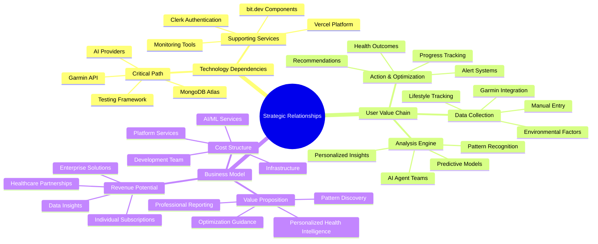
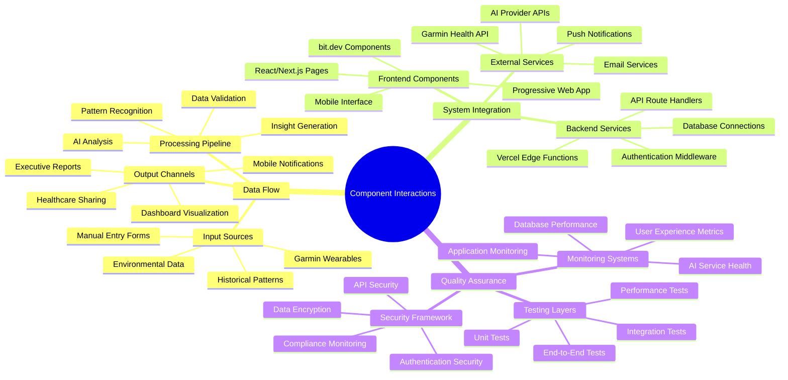
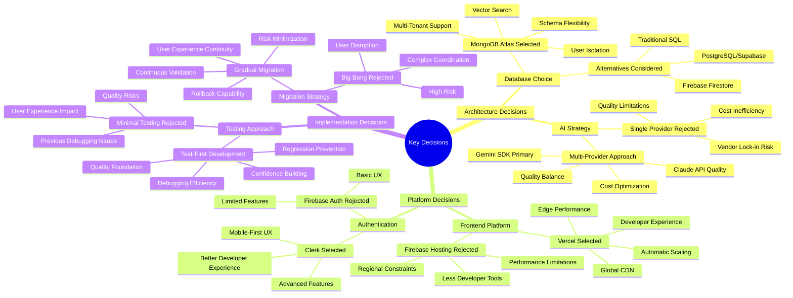
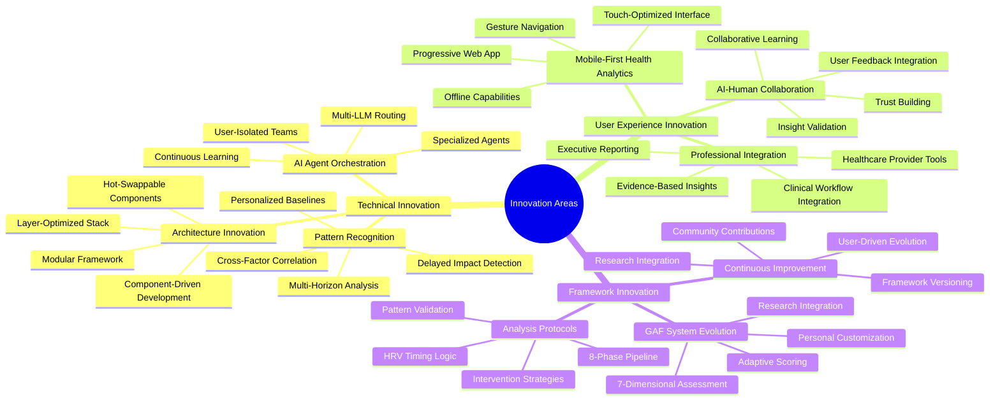

# GAF System - Mind Map

## Project Conceptual Overview

This mind map provides a comprehensive visual representation of the GAF System transformation, showing relationships between all major components, stakeholders, and strategic decisions.

## Complete GAF System Mind Map

```mermaid
mindmap
  root((GAF System Transformation))
    Current State
      React + Supabase
        Functional Dashboard
        Basic Garmin Integration
        794-line Daily Entry Form
        Early Development Phase
      Technical Debt
        Web Scraping Issues
        Circular Debugging Problems
        No Testing Framework
        Limited Mobile Support
      Existing Capabilities
        User Authentication
        Health Data Visualization
        Pattern Detection Engine
        GAF Analysis Pipeline
    
    Target Architecture
      Layer-Optimized Stack
        Frontend Layer
          Vercel Hosting
          bit.dev Components
          Next.js Migration
          Mobile-First Design
        Authentication Layer
          Clerk Integration
          Multi-User Support
          OAuth Management
          Session Handling
        Backend Layer
          Vercel Edge Functions
          API Route Optimization
          Global Performance
          Serverless Scaling
        AI Layer
          Gemini SDK Primary
          Claude API Quality
          LLM Router Logic
          Multi-Provider Strategy
        Database Layer
          MongoDB Atlas
          Vector Search
          User Isolation
          Schema Flexibility
      
    AI Intelligence Core
      Agent Orchestration
        Master Orchestrator
          Task Distribution
          Workflow Management
          Error Handling
          Performance Monitoring
        Specialized Agents
          Pattern Recognition Agent
          Recommendation Agent
          Alert Detection Agent
          Executive Report Agent
        User Isolation
          Individual Agent Teams
          Personalized Learning
          Data Separation
          Privacy Protection
      Machine Learning
        Pattern Recognition
          Multi-Horizon Analysis
          24-96 Hour Windows
          Delayed Impact Detection
          Cross-Factor Correlation
        Personalized Models
          Individual Baselines
          Adaptive Thresholds
          Custom Scoring
          Continuous Learning
        Vector Operations
          Health Pattern Embeddings
          Semantic Similarity
          Pattern Matching
          Insight Discovery
      
    GAF Framework
      7-Dimensional Assessment
        Physical Health
        Mental Wellbeing
        Energy Levels
        Sleep Quality
        Stress Management
        Recovery Metrics
        Performance Indicators
      Analysis Protocols
        8-Phase Analysis Pipeline
        HRV Timing Logic
        Pattern Validation
        Intervention Strategies
      Framework Evolution
        Modular Architecture
        Version Management
        Backward Compatibility
        User Customization
        
    Data Integration
      Garmin Health API
        OAuth 1.0a Authentication
        Official API Endpoints
        Real-time Synchronization
        Historical Data Import
        Comprehensive Validation
      Health Metrics
        Heart Rate Variability
        Sleep Patterns
        Activity Data
        Stress Indicators
        Recovery Metrics
      Data Quality
        Validation Frameworks
        Error Detection
        Data Cleansing
        Reliability Scoring
        Audit Trails
        
    User Experience
      Mobile-First Design
        Touch-Friendly Interface
        Offline Capabilities
        Progressive Web App
        Responsive Components
        Gesture Navigation
      Daily Workflows
        Morning Health Entry
        Real-time Monitoring
        Evening Reflection
        Pattern Exploration
        Insight Validation
      Professional Features
        Executive Reporting
        Healthcare Provider Sharing
        Trend Analysis
        Custom Dashboards
        Export Capabilities
        
    Stakeholder Ecosystem
      Primary Users
        Health-Conscious Individuals
          Personal Optimization
          Data-Driven Decisions
          Pattern Understanding
          Lifestyle Improvement
        Healthcare Providers
          Patient Monitoring
          Clinical Insights
          Treatment Planning
          Outcome Tracking
      Technology Partners
        Garmin Integration
          API Partnership
          Data Access
          Compliance Requirements
          User Authorization
        AI Providers
          Gemini SDK
          Claude API
          Vertex AI Future
          Multi-Provider Strategy
      Support Network
        Family Members
          Health Awareness
          Emergency Alerts
          Progress Sharing
          Motivation Support
        Development Team
          Technical Excellence
          Quality Assurance
          Innovation Drive
          User Focus
          
    Implementation Strategy
      Phase 1 Foundation
        Testing Framework
          Unit Testing
          Integration Testing
          End-to-End Testing
          Automated Regression
        Platform Migration
          Database Migration
          Authentication Setup
          Frontend Modernization
          CI/CD Pipeline
        Garmin Integration
          API Authentication
          Data Synchronization
          Validation Framework
          Error Handling
      Phase 2 AI Core
        Agent Development
          Orchestrator Implementation
          Specialized Agents
          User Isolation
          Knowledge Persistence
        Pattern Recognition
          ML Model Training
          Threshold Detection
          Correlation Analysis
          Insight Generation
        Learning System
          Feedback Integration
          Model Improvement
          User Validation
          Effectiveness Tracking
      Phase 3 Production
        Monitoring System
          Real-time Alerts
          Health Thresholds
          Emergency Protocols
          Notification Management
        Reporting Features
          Executive Reports
          Professional Sharing
          Trend Analysis
          Custom Templates
        Quality Assurance
          Security Audit
          Performance Testing
          User Acceptance
          Compliance Validation
          
    Success Metrics
      Technical KPIs
        Response Time <2s
        Uptime 99.9%
        Data Accuracy 100%
        Test Coverage >90%
      User Experience KPIs
        Daily Engagement >80%
        User Satisfaction >4.5/5
        Feature Adoption >70%
        Monthly Retention >90%
      Business KPIs
        Healthcare Adoption >20%
        Cost Efficiency $0-300/month
        Framework Evolution
        Market Leadership
      Quality KPIs
        Bug Resolution <24h
        Security Compliance 100%
        Performance Benchmarks
        User Feedback Integration
        
    Risk Management
      Technical Risks
        AI Integration Complexity
          Multi-Provider Coordination
          Performance Requirements
          Quality Consistency
          Error Handling
        Platform Migration
          Data Integrity
          Zero Downtime
          Feature Compatibility
          User Experience
        External Dependencies
          Garmin API Reliability
          AI Service Availability
          Third-Party Integrations
          Regulatory Compliance
      Mitigation Strategies
        Comprehensive Testing
          Automated Test Suites
          Quality Assurance
          User Acceptance Testing
          Performance Validation
        Fallback Systems
          Multi-Provider AI
          Data Backup Strategies
          Service Redundancy
          Graceful Degradation
        Monitoring & Alerting
          Real-time Monitoring
          Proactive Alerts
          Performance Tracking
          Issue Resolution
          
    Future Evolution
      Advanced Features
        Predictive Analytics
        Personalized Interventions
        Community Features
        Research Integration
      Platform Expansion
        Mobile Applications
        Wearable Integration
        IoT Device Support
        API Ecosystem
      Market Opportunities
        Healthcare Partnerships
        Research Collaborations
        Enterprise Solutions
        Global Expansion
```

## Strategic Relationship Map

## Component Interaction Map

## Decision Tree Map

## Innovation & Differentiation Map

This comprehensive mind map provides a complete conceptual overview of the GAF System transformation, showing all major relationships, dependencies, and strategic considerations. It serves as a visual reference for understanding the project's complexity and interconnected nature while highlighting key innovation areas and decision points.