# GAF System - Project Management Visual Suite

## Overview

This directory contains a comprehensive visual project management system for the GAF System transformation. Each document provides a different perspective on the project, designed to give you complete oversight across all areas of project management.

## Visual Management Documents

### 1. [Project Roadmap & Timeline](./01-project-roadmap.md) 🗓️

**Purpose:** High-level timeline and milestone tracking  
**Best for:** Executive overview, deadline management, critical path analysis  
**Key Features:**

- 12-week transformation timeline
- Major milestone tracking
- Critical dependency identification
- Risk mitigation timeline
- Success metrics and KPIs

### 2. [Kanban Board](./02-kanban-board.md) 📋

**Purpose:** Task flow and sprint management  
**Best for:** Daily development tracking, bottleneck identification, team coordination  
**Key Features:**

- Current sprint status
- Task progression (Backlog → To Do → In Progress → Review → Done)
- Story point tracking
- Blocker identification
- Team workload distribution

### 3. [Architecture Diagram](./03-architecture-diagram.md) 🏗️

**Purpose:** Technical system overview and component relationships  
**Best for:** Technical decision making, integration planning, system understanding  
**Key Features:**

- Layer-optimized 5-platform architecture
- Component interaction flows
- Security architecture
- Deployment architecture
- Performance and scalability design

### 4. [User Journey Map](./04-user-journey-map.md) 👤

**Purpose:** User experience and interaction flow analysis  
**Best for:** UX optimization, feature prioritization, user satisfaction improvement  
**Key Features:**

- Complete user lifecycle mapping
- Emotional journey tracking
- Pain point identification
- Moment of truth analysis
- Multi-persona journey flows

### 5. [Stakeholder Map](./05-stakeholder-map.md) 🤝

**Purpose:** Relationship management and communication planning  
**Best for:** Stakeholder engagement, risk management, communication strategy  
**Key Features:**

- Influence-interest matrix
- Communication frequency planning
- Risk assessment by stakeholder
- Engagement strategy development
- Success metrics by stakeholder group

### 6. [Work Breakdown Structure](./06-work-breakdown-structure.md) 📊

**Purpose:** Detailed task hierarchy and resource allocation  
**Best for:** Project planning, resource management, progress tracking  
**Key Features:**

- 3-level task hierarchy
- Resource allocation matrix
- Timeline and dependency mapping
- Budget breakdown
- Deliverable acceptance criteria

### 7. [Mind Map](./07-mind-map.md) 🧠

**Purpose:** Conceptual overview and relationship visualization  
**Best for:** Strategic thinking, brainstorming, comprehensive understanding  
**Key Features:**

- Complete system conceptualization
- Strategic relationship mapping
- Component interaction visualization
- Decision tree documentation
- Innovation area identification

## How to Use This Visual Suite

### For Daily Management

1. **Start with Kanban Board** - Check current sprint status and daily tasks
2. **Review User Journey Map** - Ensure user-focused development priorities
3. **Check Stakeholder Map** - Plan daily communications and feedback sessions

### For Weekly Planning

1. **Review Project Roadmap** - Assess milestone progress and timeline adherence
2. **Update Work Breakdown Structure** - Adjust resource allocation and task priorities
3. **Analyze Architecture Diagram** - Validate technical decisions and integration progress

### For Strategic Reviews

1. **Study Mind Map** - Comprehensive project understanding and relationship analysis
2. **Review All Documents** - Cross-reference insights and identify optimization opportunities
3. **Update Based on Learnings** - Evolve visual management based on project progression

## Document Relationships

```mermaid
graph TB
    ROADMAP[📅 Project Roadmap]
    KANBAN[📋 Kanban Board]
    ARCH[🏗️ Architecture]
    JOURNEY[👤 User Journey]
    STAKEHOLDER[🤝 Stakeholder Map]
    WBS[📊 Work Breakdown]
    MINDMAP[🧠 Mind Map]

    ROADMAP --> KANBAN
    ROADMAP --> WBS
    ARCH --> KANBAN
    JOURNEY --> KANBAN
    STAKEHOLDER --> ROADMAP
    WBS --> KANBAN
    MINDMAP --> ROADMAP
    MINDMAP --> ARCH
    MINDMAP --> JOURNEY

    style ROADMAP fill:#4ECDC4,color:#000000
    style KANBAN fill:#FF6B6B,color:#ffffff
    style ARCH fill:#45B7D1,color:#ffffff
    style JOURNEY fill:#96CEB4,color:#000000
    style STAKEHOLDER fill:#FFEAA7,color:#000000
    style WBS fill:#DDA0DD,color:#000000
    style MINDMAP fill:#98D8C8,color:#000000
```

## Key Project Insights

### Critical Success Factors

1. **Reliable Garmin Integration** - Foundation for all health analysis
2. **Comprehensive Testing Framework** - Prevents circular debugging issues
3. **User-Isolated AI Architecture** - Enables personalized health intelligence
4. **Mobile-First User Experience** - Daily engagement and habit formation
5. **Professional Reporting Capabilities** - Healthcare provider integration

### Major Risk Areas

1. **External Dependencies** - Garmin API approval, AI service availability
2. **Technical Complexity** - Multi-platform integration, AI orchestration
3. **User Experience** - Complex daily form, mobile optimization
4. **Data Migration** - Zero-loss transition from current system
5. **Performance Requirements** - <2 second response time constraint

### Innovation Opportunities

1. **AI Agent Orchestration** - User-isolated, specialized agent teams
2. **Multi-Horizon Pattern Analysis** - 24-96 hour delayed impact detection
3. **Layer-Optimized Architecture** - 5-platform cost-performance optimization
4. **Professional Health Intelligence** - Executive reporting for healthcare providers
5. **Continuous Framework Evolution** - User-driven GAF system improvement

## Maintenance & Updates

### Weekly Updates

- Update Kanban Board with current sprint progress
- Refresh Project Roadmap milestone status
- Review and adjust User Journey pain points

### Monthly Reviews

- Comprehensive stakeholder map assessment
- Work breakdown structure resource reallocation
- Architecture diagram evolution based on learnings

### Quarterly Evolution

- Complete mind map refresh with new insights
- Strategic roadmap adjustments
- Visual suite optimization based on usage patterns

## Success Metrics

### Project Management Effectiveness

- **Decision Speed:** Reduced decision time through visual clarity
- **Communication Efficiency:** Stakeholder alignment through shared visuals
- **Risk Mitigation:** Early identification through comprehensive mapping
- **Resource Optimization:** Efficient allocation through detailed breakdown

### Visual Suite Usage

- **Daily Reference:** Kanban Board, User Journey Map
- **Weekly Planning:** Project Roadmap, Work Breakdown Structure
- **Strategic Reviews:** Mind Map, Architecture Diagram, Stakeholder Map
- **Continuous Improvement:** Regular updates and evolution of all documents

This visual project management suite provides comprehensive oversight of the GAF System transformation, ensuring all aspects of the project are visible, manageable, and optimized for success.
